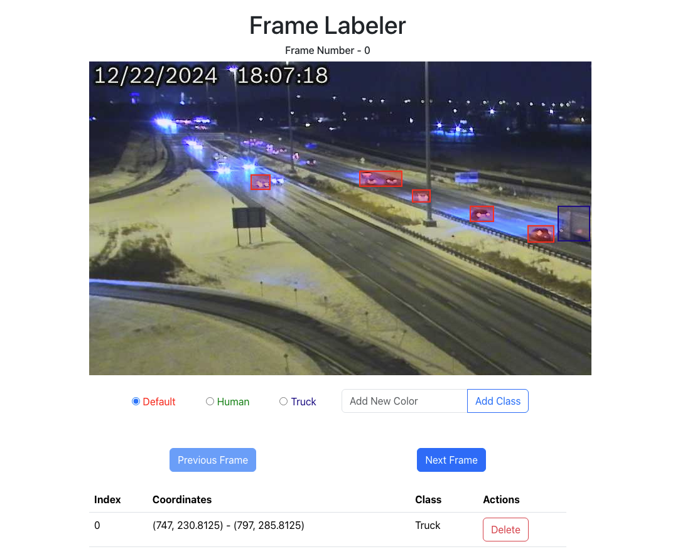
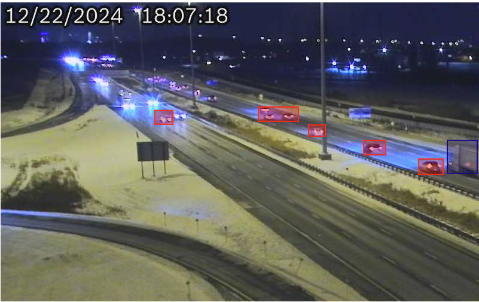

# Frame Labeler

## Introduction

This project implements a tool for labeling video frames by drawing bounding boxes around objects of interest. The goal of the tool is to help computer vision engineers efficiently create high-quality training data by labeling objects in video frames. The project includes features for navigating through video frames, drawing bounding boxes, and managing them via an interactive UI.

This is a **personal project** created to demonstrate skills in building UI components, state management, and using the HTML5 Canvas API for rendering bounding boxes on video frames.

## Features

- **Frame Navigation**: Users can navigate through video frames using "Previous Frame" and "Next Frame" buttons.
- **Bounding Box Drawing**: Users can click and drag to draw bounding boxes on video frames.
- **Bounding Box List**: A list of bounding boxes appears below the video, showing their coordinates and associated labels.
- **Delete Bounding Boxes**: Bounding boxes can be deleted from the list by clicking the delete button.
- **Persistent Data**: The application remembers the bounding boxes drawn on each frame, even when switching between frames.

## Technologies Used

- **React**: The user interface is built using React to manage the components and state.
- **HTML5 Canvas**: Used for rendering the video frames and drawing the bounding boxes.
- **State Management**: Redux is used for managing the state of the app, such as the current frame index and bounding boxes.
- **CSS**: Styled using custom CSS for layout and design.
- **Fetch API**: Used to fetch video metadata and frame images from a server.

## Requirements

- The first frame of the video should appear when the page first loads.
- Clicking the "Next" and "Previous" buttons should load the appropriate frame.
- Users can draw bounding boxes by clicking and dragging the mouse.
- Bounding boxes' coordinates and labels should be saved and persisted.
- Bounding boxes are shown in a list, and users can delete them.

## Features and Components

### 1. **FrameNavigator Component**

This component includes "Previous" and "Next" buttons to navigate between video frames. When a button is clicked, the current frame index updates, triggering a new frame to be displayed.

**Frame Navigation:**

	

### 2. **BoundingBoxCanvas Component**

This component is responsible for displaying video frames and handling mouse events to draw bounding boxes. The bounding boxes are stored in the state and rendered onto the canvas.

**Bounding Box Drawing:**

	

### 3. **BoundingBoxList Component**

This component renders a table listing all the bounding boxes associated with the current frame. It allows users to delete individual bounding boxes from the list.

### 4. **LabelSelector Component**

This component allows users to select or add new labels for bounding boxes. Labels are displayed with their associated colors.
